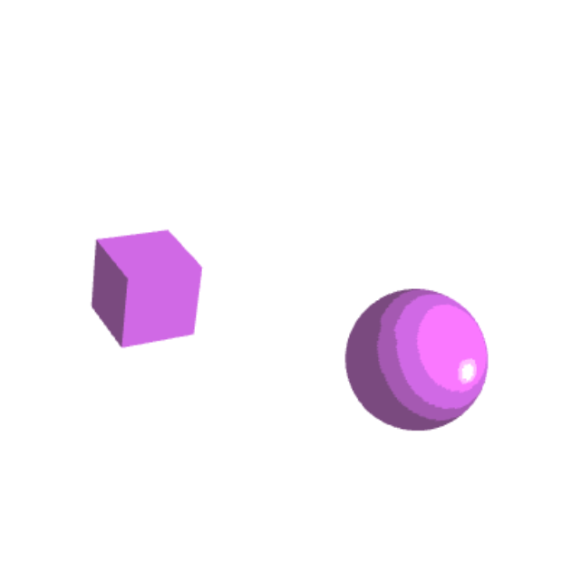
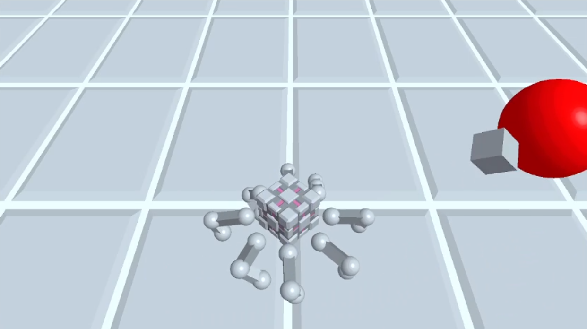

## The "Hello World!" of a 3D Graphics Engine
```
Author    : Evan Bertis-Sample
NetID     : eab0652
Date      : 1-29-2024
Course    : CS 351 - Introduction to Computer Graphics
Assignment: Project A - Moving, Jointed 3D Assemblies
```


*A render of the final scene, featuring a cube robot with 8 legs on a platform that multiple dyson spheres orbit around.*

### Goals and Ambitions
*I'm going to keep it pretty casual for this report, while explaining my otherwise overengineered first project.*

Coming from the game development world, I was extremely excited to take this class, especially after seeing the syllabus. I grew up as an artist, but a few years back, I pivoted towards programming and game development. As such, I figured that this first project would be a great oppurtunity to show my guns as an artist, and a game developer.

Going into the project, I had a few goals in mind:

* **To implement a scene graph, and a system for rendering it** - I know the professor advised against this, but I had done it before using C++, and figured it'd allow me to design more complex assemblies.
* **To implement a system for loading and rendering 3D models** - I don't really like hard coding things if I can avoid it.
* **To implement an entity-component system** - Game development has spoiled me with its flexibility, and I wanted to bring that into this project.
* **To create an abstraction for a "Material"** that could be applied to any 3D model - this is just a luxury that I am used to from game development.
* **To implement Phong shading**, and stlyized "toon" shading - I'm a big fan of stylized rendering, and have done a lot of work with it in the past.
* **To implement a basic IK system** for the legs of a robot - This is something that I've always wanted to do, but never had the chance to.

I'd say I have acheivedm most of these goals, but with varying degrees of success. While functionally all of these systems work, they are not as polished as I would like them to be. Namely, my material system is a bit of a mess, and my IK system is not as robust as I would like it to be.



*Early development of Phong Shading, before the material abstraction was fully created.*

### Help Guide

Running the project is simple. Just double click on the `index.html` file, and it should open in your default web browser. The controls are as follows:

* **WASD** - Move player around
* **Mouse** - Look around - only works on the y-axis (this was a design choice)
* **Toggle Lighting** - Switches between Phong shading and showing the normals of the models (added retroactively to furfill the per-vertex normal requirement in a more obvious way)


*I endured a lot of pain at the beginning of this project, trying to figure out how to talk to the GPU.*

### Requirement Fulfillment

**Standard Credits**

* **All file-naming, correct with illustrated PDF report** - You're reading it!
* **Sensible, Complete On-Screen User Instructions** - In `index.html`, featured under the canvas.
* **At least two different rigid 3D parts that YOU designed** - The robot, the dyson spheres, and the platform.
* **Rasterized per-vertex colors-everywhere** - Phong Shading system entails that I have to have per-vertex normals (which is the same thing as per-vertex colors). But I also have a debug mode that shows the normals of the models, and these colors do not change based on the position of the meshes (to show that they are per-vertex).
* **Traveling Assembly** - The robot moves in world space, and the dyson spheres orbit around the platform.
* **Flexing/Spinning Joints** - The robot is always bobbing up and down, without input from the user, causing the joint angles to change. The dyson spheres are always spinning around the platform.
* **KINDS: Two or more obviously-different kinds of assemblies of rigid 3D parts** = The robot and the dyson spheres. The robot consists of a body, and 8 legs (which are made from 5 parts each -- the hip, the upper leg, the knee, the lower leg, and the foot). The dyson spheres are made from 2 parts each -- the black hole and the ring.
* **At least one kind of assembly must have two or more sequential, moving joints** - The robot's legs are made of 5 joints each (body to hip, hip to upper leg, upper leg to knee, knee to lower leg, lower leg to foot).
* **Keyboard Interaction** - WASD for movement.
* **Mouse-Drag Interaction** - Look around on the y-axis.

**Extra Credit**
* **Additional Webpage Controls** - not attempted
* **User-Adjustable Color** - The toggle between Phong shading and showing the normals of the models.
* **User Adjustable Flex-Angle** - not attempted
* **Accurate Scene Graph Diagram** - not attempted, the scene graph would be really overcomplicated to draw out.



*The scene the day after demo day, featuring a robot with 8 legs, and some weird balls that are kind of like planets.*

### Acknowledgement

I recognize that the work that I have done covers topics that have not been covered in this class yet. I also do recognize the possible suspicisons that the code here is not my own, but I assure you that it is. I am not too sure how to prove this, beyond redirecting you to my GitHub, where you can look at other projects that I have done, and see that they are of similar quality. For example, feel free to check out my work-in-progress 3D engine that I made that runs in the terminal using ASCII art using C++ [here](https://github.com/Evan-Bertis-Sample/rascii), or any of my game projects [here](https://evanmakesstuff.itch.io/). I would be willing to share my github repository with you, but Northwestern has a policy against public repositories, so I cannot easily do that without inviting you to my private repository.

I figured that I'd add this section because I recognize that the work that I have done on this project is far beyond what was expected of me, and upon inspection of this project, could reasonably be assumed to be using a library like Three.js. I assure you that I have not, and that I have done all of this work myself. I am simply very passionate about programming for artistic expression.

