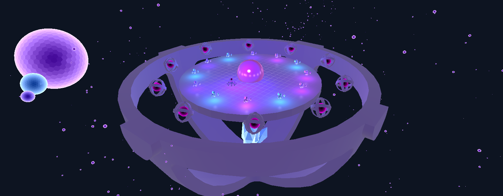
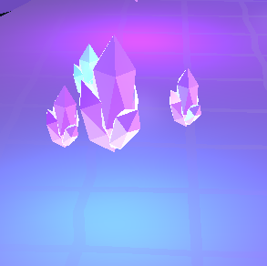
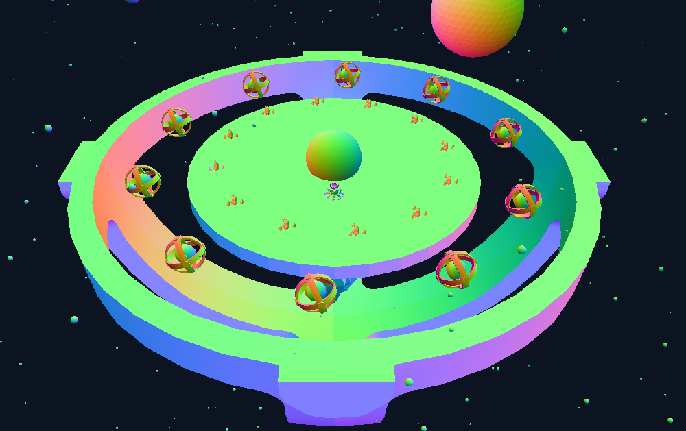

## Cameras, Cameras, Cameras
```
Author    : Evan Bertis-Sample
NetID     : eab0652
Date      : 2-19-2024
Course    : CS 351 - Introduction to Computer Graphics
Assignment: Project B - 3D Views
```


*A render of the final scene, featuring a cube robot with 8 legs on a platform that multiple dyson spheres orbit around.*

### Goals and Ambitions

Last project, I had already implemented a basic camera system, which made this project fairly trivial to implement. However, there were a few things that I wanted to do to improve upon my camera implementation:

* Improve the camera system to be more flexible, and support multiple cameras
* Make the camera operate independently of the scene graph
* Add support for a variable amount of viewports

In addition, I wanted to make a scene that was more complex than the last one, and that would be more interesting to look at. I've opted to continue with the space theme, but added a few more elements to the scene to make it more interesting. These elements include:

* A robot with 8 legs
* A platform that the robot stands on
* Multiple dyson spheres that orbit around the platform
* Crystals that are scattered around the scene (NEW)
* Planets that orbit around the dyson spheres (NEW)
* A head for the robot (NEW)
* A grid texture for the platform (NEW)


### Assemblies

 

1. The robot, which is made up of 8 legs, a body, and a head. Each leg is made out of 5 segments, and the body and head are made of 3 segments total.


2. The dyson spheres, which are made up of a black hole and a ring. These are joined together such that black hole is the parent of the ring.



3. The platform, which is made of 3 segments, the actual platform that the robot stands on, the ring around the platform, and the crystal beneath the platform.



4. Each crystal is comprised of 4 segments. The base, and the 3 surrounding crystals that orbit around the base. The base is the parent of the 3 surrounding crystals.


5. The planet is combrised of 3 segments. The planet, it's moon, and the moon's moon. The planet is the parent of the moon, and the moon is the parent of the moon's moon.


### Help Guide

Running the project is simple. Just double click on the `Bertis-SampleEvan_ProjB.html` file, and it should open in your default web browser. The controls are as follows:


* **WASD** - Move to move the player character
* **Space** - Switch the camera mode for the left viewport
    * For the Follow mode, the camera will follow the robot
    * For the Free mode, the camera will be free to move around the scene, and can be controlled using the mouse and WASD
* **Mouse Drag (left viewport)** - Rotate the crystals around the platform
* **Mouse Drag (right viewport)** - Rotate the orthographic camera around the scene

All controls can be viewed by clicking the `Controls` button in the bottom left of the screen.

Additionally, there is a button in the bottom left of the screen (`Toggle Lighting`) that will toggle between the Phong shading system and the debug mode, which shows the normals of the models. This is useful for debugging the scene, and seeing how the lighting system works.

### Results

Here are some screenshots of the scene from different angles:





